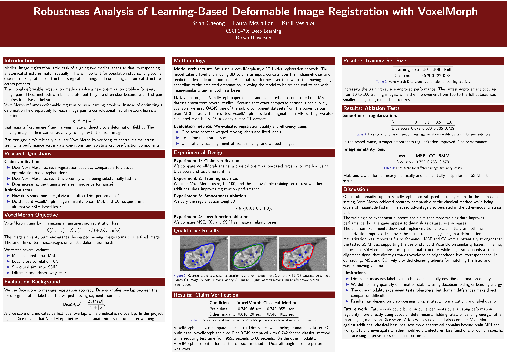

# Robustness Analysis of Learning-Based Deformable Image Registration with VoxelMorph

**CSCI 1470: Deep Learning — Brown University**  
Brian Cheong · Laura McCallion · Kirill Vesialou

This project critically evaluates [VoxelMorph](https://github.com/voxelmorph/voxelmorph) (Balakrishnan et al., 2019) by verifying its central claims, stress-testing its performance across data conditions, and ablating key loss-function components. We train on brain MRI (OASIS-1) and kidney CT (KiTS23) and run four experiments:

1. **Claim verification** — does VoxelMorph match classical registration accuracy while being substantially faster?
2. **Training set size** — does more data improve Dice? (10 / 100 / full)
3. **Smoothness ablation** — how does λ ∈ {0, 0.1, 0.5, 1.0} affect performance?
4. **Loss function ablation** — MSE vs NCC vs SSIM

---



---

## Repository layout

```
.
├── scripts/
│   ├── preprocess_kits.py              # KiTS23: resample → normalize → affine-align to atlas
│   ├── preprocess_nii_to_npy.py        # KiTS23: .nii.gz → .npy for fast loading
│   ├── preprocess_oasis.py             # OASIS: resample → normalize → center crop/pad
│   ├── preprocess_nii_to_npy_oasis     # OASIS: .nii.gz → .npy for fast loading
│   ├── make_oasis_split.py             # Generate oasis_split.json (run once)
│   ├── train_kits.py                   # Train VoxelMorph on KiTS23
│   ├── train_oasis.py                  # Train VoxelMorph on OASIS (all experiments)
│   ├── test_kits.py                    # Evaluate on KiTS23 test set
│   └── test_oasis                      # Evaluate on OASIS test set
├── slurm/
│   ├── run_preprocess_kits.sh          # SLURM: preprocess KiTS23
│   ├── run_preprocess_oasis.sh         # SLURM: preprocess OASIS
│   ├── run_train_kits.sh               # SLURM: train on KiTS23
│   ├── run_train_oasis.sh              # SLURM: Exp 1 training (full, NCC, λ=1.0)
│   ├── run_test_kits.sbatch            # SLURM: evaluate KiTS23 model
│   ├── run_test_oasis.sh               # SLURM: evaluate OASIS model
│   ├── run_ablation_lambda.sh          # SLURM: Exp 3 — submit λ sweep jobs
│   ├── run_ablation_loss.sh            # SLURM: Exp 4 — submit loss sweep jobs
│   ├── run_trainsize_sweep.sh          # SLURM: Exp 2 — submit training size sweep jobs
│   └── run_eval_ablations.sh           # SLURM: evaluate all ablation models
├── weights/
│   ├── kits_vxm_4_20.h5               # VoxelMorph trained on KiTS23
│   ├── kits_vxm.h5                     # Earlier KiTS23 checkpoint
│   ├── vxm_dense_brain_T1_3D_mse.h5   # Pretrained VoxelMorph brain model (MSE)
│   └── vxm_weights.h5                  # OASIS trained weights
├── results/
│   ├── dice_results_kits_4_20.txt              # KiTS23 VoxelMorph Dice scores
│   ├── dice_results_kits_4_20_onlyaffine_nowarp.txt  # KiTS23 affine-only baseline
│   └── dice_results_kits_4_20_random_weights.txt     # KiTS23 random-weight control
├── kits_split.json                     # KiTS23 train/val/test case IDs
├── oasis_split.json                    # OASIS train/val/test subject IDs
└── checkin2.md                         # Project check-in notes
```

---

## Environment setup

```bash
conda create -n voxelmorph_tf python=3.9
conda activate voxelmorph_tf
pip install tensorflow==2.12 voxelmorph nibabel SimpleITK
```

SLURM scripts assume this conda environment at:
`/users/bcheong/.conda/envs/voxelmorph_tf/bin/python`

---

## Data

### OASIS-1 (brain MRI)
Download from https://www.oasis-brains.org (free registration required). Requires FreeSurfer outputs: `mri/brain.mgz` and `mri/aparc+aseg.mgz` for each subject.

### KiTS23 (kidney CT)
Download from https://github.com/neheller/kits23.

Update the `root_dir` path at the top of the relevant preprocessing script to point to your local download.